# Radiary Implementation Plan

---

## Section A: Core Infrastructure

### A1. Scene Auto-Save / Crash Recovery

**Goal:** Periodically snapshot the scene to a temp file; recover unsaved work after a crash.

**Files to modify:**
- [AppWindow.h](file:///c:/Users/yeowk/Documents/GitHub/radiary/src/app/AppWindow.h) — new members
- [AppWindow.cpp](file:///c:/Users/yeowk/Documents/GitHub/radiary/src/app/AppWindow.cpp) — timer logic
- [AppWindowLayers.cpp](file:///c:/Users/yeowk/Documents/GitHub/radiary/src/app/AppWindowLayers.cpp) — hook into undo push

**Steps:**

1. **Define the auto-save path.** Add a helper function that returns `%APPDATA%/Radiary/autosave.radiary` (or a sibling of the exe):
   ```cpp
   // AppWindow.h — new private method
   static std::filesystem::path AutoSavePath();
   ```

2. **Add auto-save state members** to [AppWindow.h](file:///c:/Users/yeowk/Documents/GitHub/radiary/src/app/AppWindow.h):
   ```cpp
   std::chrono::steady_clock::time_point lastAutoSave_ {};
   bool sceneModifiedSinceAutoSave_ = false;
   static constexpr int kAutoSaveIntervalSeconds = 60;
   ```

3. **Mark dirty on undo push.** In [AppWindowLayers.cpp](file:///c:/Users/yeowk/Documents/GitHub/radiary/src/app/AppWindowLayers.cpp) [PushUndoState()](file:///c:/Users/yeowk/Documents/GitHub/radiary/src/app/AppWindowLayers.cpp#143-150) (line 143), set `sceneModifiedSinceAutoSave_ = true`.

4. **Perform the auto-save** in [RenderTick()](file:///c:/Users/yeowk/Documents/GitHub/radiary/src/app/AppWindow.cpp#745-768) ([AppWindow.cpp:745](file:///c:/Users/yeowk/Documents/GitHub/radiary/src/app/AppWindow.cpp#L745)). After [ProcessPendingExport()](file:///c:/Users/yeowk/Documents/GitHub/radiary/src/app/AppWindow.cpp#831-860), check:
   ```cpp
   if (sceneModifiedSinceAutoSave_) {
       auto now = std::chrono::steady_clock::now();
       if (now - lastAutoSave_ > std::chrono::seconds(kAutoSaveIntervalSeconds)) {
           serializer_.Save(scene_, AutoSavePath());
           lastAutoSave_ = now;
           sceneModifiedSinceAutoSave_ = false;
       }
   }
   ```

5. **Delete auto-save on clean exit.** In [Run()](file:///c:/Users/yeowk/Documents/GitHub/radiary/src/app/AppWindow.cpp#336-371) (line 356), before `SaveUserSettings()`:
   ```cpp
   std::filesystem::remove(AutoSavePath());
   ```

6. **Check for recovery on startup.** In [Create()](file:///c:/Users/yeowk/Documents/GitHub/radiary/src/app/AppWindow.cpp#140-335), after `LoadUserSettings()` (line 263):
   ```cpp
   if (std::filesystem::exists(AutoSavePath())) {
       Scene recovered;
       if (serializer_.Load(AutoSavePath(), recovered)) {
           // Show a dialog: "Recovered unsaved work. Restore?"
           int result = MessageBoxW(window_, L"Unsaved work was recovered from a previous session.\nRestore it?",
                                    L"Radiary - Crash Recovery", MB_YESNO | MB_ICONQUESTION);
           if (result == IDYES) {
               scene_ = std::move(recovered);
           }
           std::filesystem::remove(AutoSavePath());
       }
   }
   ```

7. **Also delete auto-save after successful Save.** In `SaveSceneToDialog()`, after the serializer writes, call `std::filesystem::remove(AutoSavePath())`.

---

### A2. Undo Stack Limit of 50

**Goal:** The limit already exists! Verify and confirm.

**Files:** [AppWindowLayers.cpp](file:///c:/Users/yeowk/Documents/GitHub/radiary/src/app/AppWindowLayers.cpp)

**Current state:** Line 13 already defines `constexpr std::size_t kHistoryLimit = 50;` and [PushUndoState()](file:///c:/Users/yeowk/Documents/GitHub/radiary/src/app/AppWindowLayers.cpp#143-150) (line 143–148) enforces it. [Redo()](file:///c:/Users/yeowk/Documents/GitHub/radiary/src/app/AppWindowLayers.cpp#179-201) (line 184–187) also enforces the same limit.

> [!NOTE]
> **No code change needed.** This is already implemented with a cap of 50.

---

## Section B: Rendering Engine

### B1. Symmetry Modes for IFS

**Goal:** Add rotational and bilateral symmetry options to the flame renderer.

**Files to modify:**
- [Scene.h](file:///c:/Users/yeowk/Documents/GitHub/radiary/src/core/Scene.h) — new scene data
- [IFSEngine.cpp](file:///c:/Users/yeowk/Documents/GitHub/radiary/src/engine/flame/IFSEngine.cpp) — CPU symmetry
- [GpuFlameRenderer.hlsl](file:///c:/Users/yeowk/Documents/GitHub/radiary/src/renderer/shaders/GpuFlameRenderer.hlsl) — GPU symmetry
- [GpuFlameRenderer.cpp](file:///c:/Users/yeowk/Documents/GitHub/radiary/src/renderer/GpuFlameRenderer.cpp) — pass constant
- [SceneSerializer.cpp](file:///c:/Users/yeowk/Documents/GitHub/radiary/src/io/SceneSerializer.cpp) — persist
- [AppWindowUI.cpp](file:///c:/Users/yeowk/Documents/GitHub/radiary/src/app/AppWindowUI.cpp) — UI controls

**Steps:**

1. **Add symmetry enum and fields** to [Scene.h](file:///c:/Users/yeowk/Documents/GitHub/radiary/src/core/Scene.h):
   ```cpp
   enum class SymmetryMode : std::uint8_t {
       None,
       Bilateral,     // Mirror across Y axis
       Rotational,    // N-fold rotational
       BilateralRotational  // Both
   };

   // Add to FlameRenderSettings (near line 230):
   SymmetryMode symmetry = SymmetryMode::None;
   int symmetryOrder = 2;  // For rotational: 2=180°, 3=120°, etc.
   ```

2. **CPU implementation** — In `IFSEngine::Render()`, after computing [(px, py)](file:///c:/Users/yeowk/Documents/GitHub/radiary/src/app/AppWindow.cpp#336-371) on the accumulation buffer, also accumulate the symmetry copies:
   ```cpp
   // After the main plot, add reflected/rotated copies
   if (scene.flameRender.symmetry != SymmetryMode::None) {
       std::vector<Vec2> symmetryPoints = GenerateSymmetryCopies(
           Vec2{px, py}, scene.flameRender.symmetry, scene.flameRender.symmetryOrder);
       for (const Vec2& sp : symmetryPoints) {
           // accumulate at sp.x, sp.y with same color
       }
   }
   ```
   Implement `GenerateSymmetryCopies()` as a static helper:
   - **Bilateral:** Plot at [(-x, y)](file:///c:/Users/yeowk/Documents/GitHub/radiary/src/app/AppWindow.cpp#336-371) in addition to [(x, y)](file:///c:/Users/yeowk/Documents/GitHub/radiary/src/app/AppWindow.cpp#336-371).
   - **Rotational:** For order N, plot at `rotate(point, 2π*k/N)` for `k = 1..N-1`.
   - **Both:** Combine bilateral + rotational.

3. **GPU implementation** — In [GpuFlameRenderer.hlsl](file:///c:/Users/yeowk/Documents/GitHub/radiary/src/renderer/shaders/GpuFlameRenderer.hlsl), add a constant buffer field:
   ```hlsl
   uint symmetryMode;
   uint symmetryOrder;
   ```
   In `AccumulateCS`, after computing the final screen position, loop through symmetry copies and write to each. This means the accumulation loop body needs to call a helper that splatts all copies.

4. **Pass constants to GPU** — In [GpuFlameRenderer.cpp](file:///c:/Users/yeowk/Documents/GitHub/radiary/src/renderer/GpuFlameRenderer.cpp), add `symmetryMode` and `symmetryOrder` to the constant buffer struct passed to the compute shader.

5. **Serialize** — In [SceneSerializer.cpp](file:///c:/Users/yeowk/Documents/GitHub/radiary/src/io/SceneSerializer.cpp), add JSON fields `"symmetry"` and `"symmetryOrder"` under the `flameRender` object.

6. **UI** — In [DrawInspectorPanel()](file:///c:/Users/yeowk/Documents/GitHub/radiary/src/app/AppWindowUI.cpp#1617-2338) (when showing flame layer), after the "Flame Space" section (~line 2261), add:
   ```cpp
   ImGui::SeparatorText("Symmetry");
   // ComboWithReset for SymmetryMode
   // SliderIntWithReset for symmetryOrder (2-12), shown only when Rotational
   ```

---

### B2. Parallelize CPU Software Renderer

**Goal:** Use thread-parallel execution for the CPU flame iteration and path rasterization.

**Files to modify:**
- [SoftwareRenderer.cpp](file:///c:/Users/yeowk/Documents/GitHub/radiary/src/renderer/SoftwareRenderer.cpp)
- [IFSEngine.cpp](file:///c:/Users/yeowk/Documents/GitHub/radiary/src/engine/flame/IFSEngine.cpp)
- [CMakeLists.txt](file:///c:/Users/yeowk/Documents/GitHub/radiary/CMakeLists.txt) — possibly nothing, MSVC has TBB built-in

**Steps:**

1. **Parallelize IFS flame iteration.** The `IFSEngine::Render()` function runs a single iteration loop accumulating into a [FlamePixel](file:///c:/Users/yeowk/Documents/GitHub/radiary/src/engine/flame/IFSEngine.h#13-20) buffer. Refactor to:
   - Split the total iteration count (e.g., `scene.previewIterations`) across `N = std::thread::hardware_concurrency()` chunks.
   - Each thread gets its own `std::mt19937` seeded with `baseSeed + threadIndex`.
   - Each thread accumulates into a **thread-local** `vector<FlamePixel>` buffer.
   - After all threads complete, merge via `output[i].density += threadBuffer[i].density; ...` for each pixel.
   - Use `std::async` or a simple loop with `std::thread` + `join()`.
   
   ```cpp
   const unsigned threadCount = std::max(1u, std::thread::hardware_concurrency());
   const std::uint32_t iterationsPerThread = totalIterations / threadCount;
   std::vector<std::vector<FlamePixel>> threadBuffers(threadCount);
   std::vector<std::thread> threads;
   for (unsigned t = 0; t < threadCount; ++t) {
       threadBuffers[t].resize(width * height);
       threads.emplace_back([&, t]() {
           RunFlameIterations(scene, width, height, threadBuffers[t],
                              iterationsPerThread, baseSeed + t);
       });
   }
   for (auto& thread : threads) { thread.join(); }
   // Merge
   for (unsigned t = 0; t < threadCount; ++t) {
       for (size_t i = 0; i < output.size(); ++i) {
           output[i].density += threadBuffers[t][i].density;
           output[i].red += threadBuffers[t][i].red;
           // ... etc
       }
   }
   ```

2. **Parallelize path triangle rasterization.** In `SoftwareRenderer::RenderViewport()`, after `BuildPathPrimitives()`, the triangle/line drawing loops can be parallelized by splitting `fillTriangles` into chunks processed by separate threads. Since each triangle rasterizes into non-overlapping pixel regions (mostly), use atomic adds or a simple mutex-free approach with tile-based splitting.

3. **Parallelize denoising/DOF.** `ApplyDenoising()` and `ApplyDepthOfField()` operate per-pixel. Wrap the outer `y` loop with `std::for_each(std::execution::par, ...)` or split the row range across threads.

4. **Guard temporal state.** The `preserveTemporalState` path must remain single-threaded (only thread 0 preserves the state). The others use independent transient state.

---

### B3. Pre-Compiling Shaders

**Goal:** Compile HLSL to DXBC blobs at build time; load blobs at runtime instead of calling `D3DCompileFromFile`.

**Files to modify:**
- [CMakeLists.txt](file:///c:/Users/yeowk/Documents/GitHub/radiary/CMakeLists.txt) — build-time compile step
- [D3D11ShaderUtils.h](file:///c:/Users/yeowk/Documents/GitHub/radiary/src/renderer/D3D11ShaderUtils.h) — new API
- [D3D11ShaderUtils.cpp](file:///c:/Users/yeowk/Documents/GitHub/radiary/src/renderer/D3D11ShaderUtils.cpp) — blob loading
- All renderer [.cpp](file:///c:/Users/yeowk/Documents/GitHub/radiary/src/main.cpp) files that call [CompileD3D11ShaderFromFile](file:///c:/Users/yeowk/Documents/GitHub/radiary/src/renderer/D3D11ShaderUtils.cpp#57-104) or [CreateD3D11ComputeShaderFromFile](file:///c:/Users/yeowk/Documents/GitHub/radiary/src/renderer/D3D11ShaderUtils.cpp#105-138)

**Steps:**

1. **Add a CMake custom command** to compile each HLSL to `.cso` (compiled shader object):
   ```cmake
   set(SHADER_FILES
       src/renderer/shaders/GpuFlameRenderer.hlsl
       src/renderer/shaders/GpuPathRenderer.hlsl
       src/renderer/shaders/GpuDenoiser.hlsl
       src/renderer/shaders/GpuDofRenderer.hlsl
       src/renderer/shaders/GpuPostProcess.hlsl
   )
   foreach(SHADER ${SHADER_FILES})
       get_filename_component(SHADER_NAME ${SHADER} NAME_WE)
       # Use fxc.exe (ships with Windows SDK)
       add_custom_command(
           OUTPUT ${CMAKE_BINARY_DIR}/shaders/${SHADER_NAME}.cso
           COMMAND fxc /T cs_5_0 /E main /O3 /Fo ${CMAKE_BINARY_DIR}/shaders/${SHADER_NAME}.cso ${CMAKE_SOURCE_DIR}/${SHADER}
           DEPENDS ${CMAKE_SOURCE_DIR}/${SHADER}
           COMMENT "Compiling shader ${SHADER_NAME}.hlsl"
       )
   endforeach()
   ```
   > Note: Each shader may have multiple entry points (e.g., `AccumulateCS`, `ToneMapCS`). Generate one `.cso` per entry point.

2. **Add a blob-loading function** to `D3D11ShaderUtils`:
   ```cpp
   ID3DBlob* LoadPrecompiledShaderBlob(const wchar_t* csoFilename, std::string& error);
   ```
   This reads the `.cso` file from [ResolveShaderPath()](file:///c:/Users/yeowk/Documents/GitHub/radiary/src/renderer/D3D11ShaderUtils.cpp#12-28) into a `D3DCreateBlob` buffer.

3. **Modify [CreateD3D11ComputeShaderFromFile](file:///c:/Users/yeowk/Documents/GitHub/radiary/src/renderer/D3D11ShaderUtils.cpp#105-138)** to try loading the `.cso` first:
   ```cpp
   // Try precompiled blob
   ID3DBlob* blob = LoadPrecompiledShaderBlob(csoFilename, error);
   if (blob == nullptr) {
       // Fall back to runtime compilation (current behavior)
       blob = CompileD3D11ShaderFromFile(shaderFilename, entryPoint, target, compileFlags, error);
   }
   ```

4. **Update each renderer** that calls these utils. The [GpuFlameRenderer](file:///c:/Users/yeowk/Documents/GitHub/radiary/src/renderer/GpuFlameRenderer.h#13-153), `GpuPathRenderer`, [GpuDenoiser](file:///c:/Users/yeowk/Documents/GitHub/radiary/src/app/AppWindowRender.cpp#778-793), `GpuDofRenderer`, and [GpuPostProcess](file:///c:/Users/yeowk/Documents/GitHub/radiary/src/app/AppWindowRender.cpp#382-409) each call [CreateD3D11ComputeShaderFromFile](file:///c:/Users/yeowk/Documents/GitHub/radiary/src/renderer/D3D11ShaderUtils.cpp#105-138). Pass both the [.hlsl](file:///c:/Users/yeowk/Documents/GitHub/radiary/src/renderer/shaders/GpuDenoiser.hlsl) and corresponding `.cso` filename so the loader knows what to look for.

5. **Keep runtime compilation in Debug builds.** Use `#ifdef _DEBUG` to skip the precompiled path so you always get fresh shader compilation during development.

---

## Section C: UI — Layers Panel

### C1. Section Labels & Color-Coded Dots for Flame vs Path Layers

**Goal:** Add "Flame Layers" / "Path Layers" section headers and a colored dot before each layer name.

**Files to modify:**
- [AppWindowUI.cpp](file:///c:/Users/yeowk/Documents/GitHub/radiary/src/app/AppWindowUI.cpp) — [DrawLayersPanel()](file:///c:/Users/yeowk/Documents/GitHub/radiary/src/app/AppWindowUI.cpp#1254-1509)

**Steps:**

1. **Add section separator before flame layers** (~line 1447, before `drawLayerList` for transforms):
   ```cpp
   if (!scene_.transforms.empty()) {
       ImGui::SeparatorText("Flame Layers");
   }
   drawLayerList(InspectorTarget::FlameLayer, RenameTarget::Transform, 0, transformNames);
   ```

2. **Add section separator before path layers** (~line 1455, before `drawLayerList` for paths):
   ```cpp
   if (!scene_.paths.empty()) {
       ImGui::SeparatorText("Path Layers");
   }
   drawLayerList(InspectorTarget::PathLayer, RenameTarget::Path, 1000, pathNames);
   ```

3. **Add color-coded dot inside `drawLayerList` lambda.** At line 1354 (inside the `else` branch where the `Selectable` is drawn), before the selectable, draw a dot:
   ```cpp
   // Before the Selectable
   const ImVec4 dotColor = (target == InspectorTarget::PathLayer)
       ? ImVec4(0.38f, 0.74f, 0.88f, 0.95f)   // Teal for path
       : ImVec4(0.97f, 0.64f, 0.34f, 0.95f);   // Orange for flame
   ImDrawList* drawList = ImGui::GetWindowDrawList();
   const ImVec2 cursor = ImGui::GetCursorScreenPos();
   const float dotRadius = 3.5f;
   const float dotY = cursor.y + ImGui::GetFrameHeight() * 0.5f;
   drawList->AddCircleFilled(ImVec2(cursor.x + dotRadius + 2.0f, dotY), dotRadius, ImGui::GetColorU32(dotColor));
   ImGui::SetCursorPosX(ImGui::GetCursorPosX() + dotRadius * 2.0f + 6.0f);
   ```

4. **Show empty state.** After each `drawLayerList` call, check if the list was empty:
   ```cpp
   if (scene_.transforms.empty()) {
       ImGui::TextDisabled("No flame layers");
   }
   ```

---

### C2. Variation Category Sub-Headers

**Goal:** Group the 60 variations into collapsible categories in the Inspector.

**Files to modify:**
- [AppWindowUI.cpp](file:///c:/Users/yeowk/Documents/GitHub/radiary/src/app/AppWindowUI.cpp) — [DrawInspectorPanel()](file:///c:/Users/yeowk/Documents/GitHub/radiary/src/app/AppWindowUI.cpp#1617-2338) (lines 2325–2333)

**Steps:**

1. **Define category groups** as a static array near the top of the file:
   ```cpp
   struct VariationCategory {
       const char* name;
       std::vector<VariationType> types;
   };
   static const VariationCategory kVariationCategories[] = {
       {"Geometric", {VariationType::Linear, VariationType::Spherical, VariationType::Horseshoe,
                      VariationType::Cylinder, VariationType::Perspective, VariationType::Conic,
                      VariationType::Astroid, VariationType::Lissajous, VariationType::Supershape}},
       {"Trigonometric", {VariationType::Sinusoidal, VariationType::Cosine, VariationType::Tangent,
                         VariationType::Sec, VariationType::Csc, VariationType::Cot, VariationType::Sech}},
       {"Fractal", {VariationType::Julia, VariationType::Spiral, VariationType::Swirl,
                    VariationType::Rings, VariationType::Rings2, VariationType::Fan, VariationType::Fan2,
                    VariationType::Droste, VariationType::Kaleidoscope, VariationType::GoldenSpiral}},
       {"Distortion", {VariationType::Curl, VariationType::Waves, VariationType::Popcorn,
                       VariationType::Bent, VariationType::Fold, VariationType::Split, VariationType::Vortex,
                       VariationType::Interference}},
       {"Organic", {VariationType::Heart, VariationType::Flower, VariationType::Blade, VariationType::Bubble,
                    VariationType::Eyefish, VariationType::Fisheye, VariationType::Handkerchief,
                    VariationType::Ex, VariationType::Blob}},
       {"Complex", {VariationType::Polar, VariationType::Disc, VariationType::Bipolar, VariationType::Wedge,
                    VariationType::Mobius, VariationType::PDJ, VariationType::TwinTrian, VariationType::Checkers,
                    VariationType::Power, VariationType::Exponential, VariationType::Hyperbolic,
                    VariationType::Diamond, VariationType::Ngon, VariationType::Arch, VariationType::Rays,
                    VariationType::Cross, VariationType::Blur}},
   };
   ```

2. **Replace the flat loop** (lines 2325–2333) with a nested loop:
   ```cpp
   ImGui::PushStyleColor(ImGuiCol_Header, ImVec4(0.13f, 0.19f, 0.32f, 0.92f));
   ImGui::PushStyleColor(ImGuiCol_HeaderHovered, ImVec4(0.18f, 0.26f, 0.42f, 1.0f));
   ImGui::PushStyleColor(ImGuiCol_HeaderActive, ImVec4(0.22f, 0.31f, 0.50f, 1.0f));
   if (ImGui::CollapsingHeader("Variations", ImGuiTreeNodeFlags_DefaultOpen)) {
       for (const VariationCategory& category : kVariationCategories) {
           // Count non-zero variations in this category
           int activeCount = 0;
           for (VariationType type : category.types) {
               if (layer.variations[static_cast<std::size_t>(type)] != 0.0) {
                   ++activeCount;
               }
           }
           // Show category with active count
           char categoryLabel[64];
           if (activeCount > 0) {
               std::snprintf(categoryLabel, sizeof(categoryLabel), "%s (%d)", category.name, activeCount);
           } else {
               std::snprintf(categoryLabel, sizeof(categoryLabel), "%s", category.name);
           }
           if (ImGui::TreeNode(categoryLabel)) {
               for (VariationType type : category.types) {
                   const std::size_t index = static_cast<std::size_t>(type);
                   const std::string label = ToString(type);
                   before = scene_;
                   changed = sliderDoubleWithReset(label.c_str(), &layer.variations[index],
                                                   &variationMin, &variationMax, "%.2f",
                                                   defaultLayer.variations[index]);
                   captureEdit(before, changed);
               }
               ImGui::TreePop();
           }
       }
   }
   ImGui::PopStyleColor(3);
   ```

---

## Section D: UI — Window & Status

### D1. Dirty Indicator (`●`) in Scene Name

**Goal:** Show a visual indicator when unsaved changes exist.

**Files to modify:**
- [AppWindow.h](file:///c:/Users/yeowk/Documents/GitHub/radiary/src/app/AppWindow.h) — new member
- [AppWindowLayers.cpp](file:///c:/Users/yeowk/Documents/GitHub/radiary/src/app/AppWindowLayers.cpp) — track dirty
- [AppWindowUI.cpp](file:///c:/Users/yeowk/Documents/GitHub/radiary/src/app/AppWindowUI.cpp) — display

**Steps:**

1. **Add a `sceneDirty_` flag** to [AppWindow.h](file:///c:/Users/yeowk/Documents/GitHub/radiary/src/app/AppWindow.h):
   ```cpp
   bool sceneDirty_ = false;
   ```

2. **Set dirty on undo push.** In [PushUndoState()](file:///c:/Users/yeowk/Documents/GitHub/radiary/src/app/AppWindowLayers.cpp#143-150) (AppWindowLayers.cpp:143):
   ```cpp
   sceneDirty_ = true;
   ```

3. **Clear dirty on save.** In `SaveSceneToDialog()`, after successful write:
   ```cpp
   sceneDirty_ = false;
   ```

4. **Clear dirty on load/reset.** In [ResetScene()](file:///c:/Users/yeowk/Documents/GitHub/radiary/src/app/AppWindowLayers.cpp#32-57) and `LoadSceneFromDialog()`:
   ```cpp
   sceneDirty_ = false;
   ```

5. **Display the indicator** in [DrawToolbar()](file:///c:/Users/yeowk/Documents/GitHub/radiary/src/app/AppWindowUI.cpp#465-686) (AppWindowUI.cpp:650–655). Before the scene name `InputText`:
   ```cpp
   if (sceneDirty_) {
       ImGui::AlignTextToFramePadding();
       ImGui::TextColored(ImVec4(0.97f, 0.64f, 0.34f, 0.95f), "%s", u8"●");
       ImGui::SameLine(0.0f, 4.0f);
   }
   ```

---

### D2. Show Scene Name or "Untitled" in Window Title Bar

**Goal:** Update the Win32 window title to reflect the current scene.

**Files to modify:**
- [AppWindow.cpp](file:///c:/Users/yeowk/Documents/GitHub/radiary/src/app/AppWindow.cpp) — new helper
- [AppWindowLayers.cpp](file:///c:/Users/yeowk/Documents/GitHub/radiary/src/app/AppWindowLayers.cpp) — call on changes

**Steps:**

1. **Add a private method** `UpdateWindowTitle()`:
   ```cpp
   void AppWindow::UpdateWindowTitle() {
       std::wstring title = L"Radiary";
       if (!scene_.name.empty()) {
           title += L" — " + Utf8ToWide(scene_.name);
       } else if (!currentScenePath_.empty()) {
           title += L" — " + currentScenePath_.filename().wstring();
       } else {
           title += L" — Untitled";
       }
       if (sceneDirty_) {
           title += L" ●";
       }
       SetWindowTextW(window_, title.c_str());
   }
   ```

2. **Call `UpdateWindowTitle()`** from:
   - [ResetScene()](file:///c:/Users/yeowk/Documents/GitHub/radiary/src/app/AppWindowLayers.cpp#32-57) — after setting the scene
   - [PushUndoState()](file:///c:/Users/yeowk/Documents/GitHub/radiary/src/app/AppWindowLayers.cpp#143-150) — after setting dirty flag
   - `SaveSceneToDialog()` — after clearing dirty flag
   - `LoadSceneFromDialog()` — after loading
   - [Undo()](file:///c:/Users/yeowk/Documents/GitHub/radiary/src/app/AppWindowLayers.cpp#159-178) / [Redo()](file:///c:/Users/yeowk/Documents/GitHub/radiary/src/app/AppWindowLayers.cpp#179-201) — after state change
   - The scene name `InputText` changed handler (toolbar, ~line 654)

---

## Section E: UI — Timeline

### E1. Add Time Ruler

**Goal:** Draw a proper ruler line at the top of the timeline track.

**Files to modify:**
- [AppWindowUI.cpp](file:///c:/Users/yeowk/Documents/GitHub/radiary/src/app/AppWindowUI.cpp) — [DrawTimelinePanel()](file:///c:/Users/yeowk/Documents/GitHub/radiary/src/app/AppWindowUI.cpp#2339-2819) (~line 2704)

**Steps:**

1. **Draw a horizontal ruler line** at `trackMin.y + topPad`, just before the tick marks loop at line 2704:
   ```cpp
   // Ruler baseline
   drawList->AddLine(
       ImVec2(trackLeft, trackMin.y + topPad),
       ImVec2(trackRight, trackMin.y + topPad),
       guide, 1.0f);
   ```

2. **Add tick height variation.** In the existing tick drawing loop (line 2704–2710), draw a short vertical notch:
   ```cpp
   const float tickHeight = 6.0f;
   drawList->AddLine(
       ImVec2(x, trackMin.y + topPad - tickHeight),
       ImVec2(x, trackMin.y + topPad),
       guide);
   ```

3. **Move the frame number labels** above the ruler line instead of inside the track (`trackMin.y + 4.0f` → `trackMin.y + topPad - tickHeight - ImGui::GetTextLineHeight() - 2.0f`). Adjust `topPad` if needed.

---

### E2. Right-Click Context Menu on Keyframes

**Goal:** Add a right-click popup on keyframe diamonds with common actions.

**Files to modify:**
- [AppWindowUI.cpp](file:///c:/Users/yeowk/Documents/GitHub/radiary/src/app/AppWindowUI.cpp) — timeline track interaction (~line 2740)

**Steps:**

1. **Detect right-click on keyframe.** After the left-click keyframe detection loop (~line 2740), add a parallel check for right-click:
   ```cpp
   if (!timelineDraggingView_ && trackHovered && ImGui::IsMouseClicked(ImGuiMouseButton_Right)) {
       const ImVec2 mouse = ImGui::GetIO().MousePos;
       for (std::size_t index = 0; index < scene_.keyframes.size(); ++index) {
           const float markerX = frameToX(static_cast<double>(scene_.keyframes[index].frame));
           const float markerY = markerYForLane(laneIndexForKeyframe(scene_.keyframes[index]));
           if (std::abs(mouse.x - markerX) <= 7.0f && std::abs(mouse.y - markerY) <= 8.0f) {
               selectedTimelineKeyframe_ = static_cast<int>(index);
               ImGui::OpenPopup("##timeline_keyframe_context");
               break;
           }
       }
   }
   ```

2. **Draw the popup** after the keyframe rendering loop:
   ```cpp
   if (ImGui::BeginPopup("##timeline_keyframe_context")) {
       if (selectedTimelineKeyframe_ >= 0 && selectedTimelineKeyframe_ < static_cast<int>(scene_.keyframes.size())) {
           const SceneKeyframe& kf = scene_.keyframes[static_cast<std::size_t>(selectedTimelineKeyframe_)];
           ImGui::TextDisabled("Frame %d", kf.frame);
           ImGui::Separator();
           if (ImGui::MenuItem("Snap Playhead Here")) {
               SetTimelineFrame(static_cast<double>(kf.frame), false);
           }
           if (ImGui::MenuItem("Duplicate Keyframe")) {
               PushUndoState(scene_);
               SceneKeyframe copy = kf;
               copy.frame = kf.frame + 1; // offset by 1
               scene_.keyframes.push_back(std::move(copy));
               SortKeyframes(scene_);
           }
           ImGui::Separator();
           if (ImGui::MenuItem("Delete Keyframe")) {
               RemoveSelectedOrCurrentKeyframe();
           }
       }
       ImGui::EndPopup();
   }
   ```

---

## Section F: UI — Camera Panel

### F1. Merge "Gate" into "Aspect" Row

**Goal:** Remove the separate "Gate" row and show the gate summary as a detail line under the aspect combo.

**Files to modify:**
- [AppWindowUI.cpp](file:///c:/Users/yeowk/Documents/GitHub/radiary/src/app/AppWindowUI.cpp) — [DrawCameraPanel()](file:///c:/Users/yeowk/Documents/GitHub/radiary/src/app/AppWindowUI.cpp#3140-3312) (~line 3227)

**Steps:**

1. **Delete the "Gate" field block** (lines 3227–3232):
   ```cpp
   // REMOVE these lines:
   fieldLabel("Gate");
   fieldWidget([&]() {
       ImGui::AlignTextToFramePadding();
       ImGui::TextDisabled("%s", CameraAspectSummary(scene_.camera).c_str());
       return false;
   });
   ```

2. **Add detail text after the Aspect combo.** After `captureCameraEdit(beforeAspectPreset, ...)` (line 3233), insert:
   ```cpp
   ImGui::PushStyleColor(ImGuiCol_Text, theme.textDim);
   ImGui::PushTextWrapPos(0.0f);
   ImGui::TextDisabled("Gate: %s", CameraAspectSummary(scene_.camera).c_str());
   ImGui::PopTextWrapPos();
   ImGui::PopStyleColor();
   ```

---

### F2. Lock Icon for Aspect Ratio

**Goal:** Add a toggle that constrains width/height to maintain the current aspect ratio when either is dragged.

**Files to modify:**
- [AppWindow.h](file:///c:/Users/yeowk/Documents/GitHub/radiary/src/app/AppWindow.h) — new member
- [AppWindowUI.cpp](file:///c:/Users/yeowk/Documents/GitHub/radiary/src/app/AppWindowUI.cpp) — [DrawCameraPanel()](file:///c:/Users/yeowk/Documents/GitHub/radiary/src/app/AppWindowUI.cpp#3140-3312)

**Steps:**

1. **Add member** to [AppWindow.h](file:///c:/Users/yeowk/Documents/GitHub/radiary/src/app/AppWindow.h):
   ```cpp
   bool cameraAspectLocked_ = false;
   ```

2. **Draw a lock toggle** between the Width and Height fields in [DrawCameraPanel()](file:///c:/Users/yeowk/Documents/GitHub/radiary/src/app/AppWindowUI.cpp#3140-3312) (~line 3236):
   ```cpp
   fieldLabel("Width");
   framingChanged = fieldWidget([&]() {
       bool changed = DragScalarWithInput(...);
       if (changed && cameraAspectLocked_) {
           const double ratio = scene_.camera.frameHeight / scene_.camera.frameWidth;
           // ratio was captured before width changed — recalculate height
           scene_.camera.frameHeight = scene_.camera.frameWidth * ratio;
       }
       return ... || changed;
   });
   // Lock button between width and height
   fieldLabel("");
   fieldWidget([&]() {
       const char* lockLabel = cameraAspectLocked_ ? "🔒 Locked" : "🔓 Unlocked";
       if (ImGui::SmallButton(lockLabel)) {
           cameraAspectLocked_ = !cameraAspectLocked_;
       }
       return false;
   });
   ```
   
   Apply the same constraint logic to the Height drag (update Width when Height changes).

> [!IMPORTANT]
> Store the original aspect ratio when locking (not derived each frame) to avoid drift.

---

### F3. Quick-Swap Width / Height

**Goal:** Add a ⇄ button to swap portrait ↔ landscape.

**Files to modify:**
- [AppWindowUI.cpp](file:///c:/Users/yeowk/Documents/GitHub/radiary/src/app/AppWindowUI.cpp) — [DrawCameraPanel()](file:///c:/Users/yeowk/Documents/GitHub/radiary/src/app/AppWindowUI.cpp#3140-3312)

**Steps:**

1. **Add a swap button** after the Width/Height rows:
   ```cpp
   fieldLabel("");
   fieldWidget([&]() {
       if (ImGui::SmallButton(u8"⇄ Swap")) {
           std::swap(scene_.camera.frameWidth, scene_.camera.frameHeight);
           framingChanged = true;
       }
       return false;
   });
   ```

---

## Section G: UI — Inspector

### G1. Responsive Inspector Layout

**Goal:** When the Inspector panel is wide enough (>600px), switch to a 2-column property grid.

**Files to modify:**
- [AppWindowUI.cpp](file:///c:/Users/yeowk/Documents/GitHub/radiary/src/app/AppWindowUI.cpp) — [DrawInspectorPanel()](file:///c:/Users/yeowk/Documents/GitHub/radiary/src/app/AppWindowUI.cpp#1617-2338)

**Steps:**

1. **Detect available width** at the start of [DrawInspectorPanel()](file:///c:/Users/yeowk/Documents/GitHub/radiary/src/app/AppWindowUI.cpp#1617-2338) (line 1617):
   ```cpp
   const float inspectorWidth = ImGui::GetContentRegionAvail().x;
   const bool useWideInspector = inspectorWidth >= 600.0f;
   ```

2. **Wrap transform controls in a 2-column table** when wide. For flame layers (lines 2200–2240), instead of sequential sliders, use:
   ```cpp
   if (useWideInspector) {
       if (ImGui::BeginTable("##transform_grid", 2, ImGuiTableFlags_SizingStretchSame)) {
           // Column 1: Weight, Rotation, Scale X, Scale Y
           ImGui::TableNextColumn();
           // ... draw sliders
           // Column 2: Offset X, Offset Y, Shear X, Shear Y, Color Index
           ImGui::TableNextColumn();
           // ... draw sliders
           ImGui::EndTable();
       }
   } else {
       // Current sequential layout
   }
   ```

3. **Apply the same pattern** to the path inspector material section (Primary Color, Accent Color, Wire Color).

4. **Leave variations as single-column** since they're already in a collapsible tree.

> [!TIP]
> The Camera panel already uses this pattern with `useWideCameraGrid` and `beginFieldGrid()`. Reuse the same `Columns()` approach.

---

## Dependency & Ordering

```mermaid
graph TB
    A1[A1: Auto-Save] --> D1[D1: Dirty Indicator]
    D1 --> D2[D2: Window Title]
    
    B1[B1: Symmetry Modes]
    B2[B2: Parallelize CPU]
    B3[B3: Pre-Compile Shaders]
    
    C1[C1: Layer Section Labels]
    C2[C2: Variation Categories]
    
    E1[E1: Time Ruler]
    E2[E2: Keyframe Context Menu]
    
    F1[F1: Merge Gate Row]
    F2[F2: Aspect Lock]
    F3[F3: Swap W/H]
    
    G1[G1: Responsive Inspector]
    
    style A1 fill:#1a2744
    style B1 fill:#1a2744
    style B2 fill:#1a2744
    style B3 fill:#1a2744
```



## Recommended Implementation Order

| Phase | Items | Rationale |
|-------|-------|-----------|
| **1 — Trivial UI wins** | A2 (already done), C1, D1, D2, F1, E1 | < 30 min each, immediate visual payoff |
| **2 — Medium UI** | C2, E2, F2, F3 | 30–60 min each, self-contained |
| **3 — Architecture** | A1, G1 | Touch multiple files but low risk |
| **4 — Engine** | B1, B2, B3 | Deeper changes, need thorough testing |
